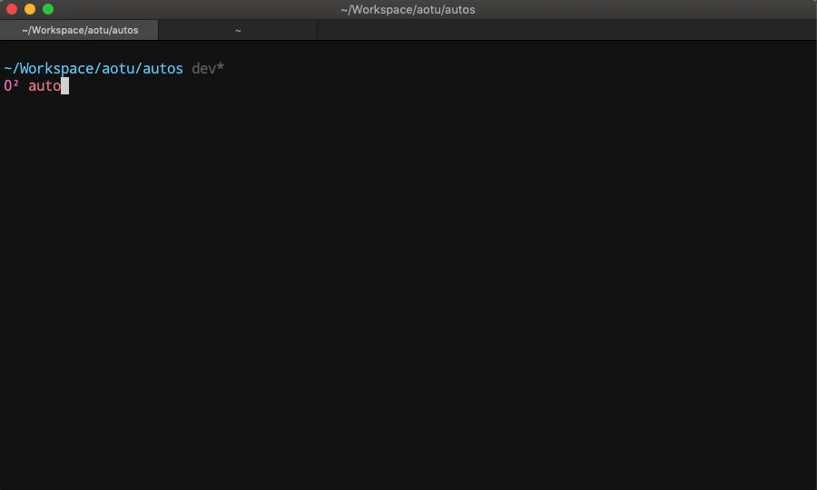

# 凹凸脚手架

- [x] 远程下载模板
- [x] 支持创建 view 和 component
- [x] 支持在当前和新文件夹初始化项目
- [x] 支持覆盖, 删除, 合并
- [ ] 优化创建模板的效率
- [x] 单独升级 webpack 打包目录
- [x] 简化配置，所有的可配置项暴露到`appConfig.js`
- [ ] 支持自定义配置
- [ ] 支持一些简单的测试

## 快速开始

```bash
$ npm i autos -g
```

## 创建新项目

```bash
$ autos init
```

或者

```bash
$ autos i
```

## 创建组件或者页面

```bash
$ autos create
```

或者

```bash
$ autos c
```

## 开发项目

```bash
$ autos dev
```

## 发布项目

### 测试环境发布项目

```bash
$ autos build -t
```

或者

```bash
$ autos build --test
```

### 正式环境发布项目

```bash
$ autos build
```

## 实际项目中使用

```bash
$ yarn dev
$ yarn test
$ yarn prod
```

或者

```bash
$ npm run dev
$ npm run test
$ npm run prod
```

## 升级项目

升级项目配置

```bash
$ autos update
```



## 开启分析仪

查看构建完成后包含的依赖关系

```bash
$ autos build -t --analyzer
```
